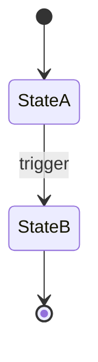

# Domain model — <concept>

- **Governing GDD sections:** <paths>
- **Governing spec section:** `design/scope/prototype-scope.md#<section>`
- **Status:** Draft | Approved
- **Date:** YYYY-MM-DD

## Non-technical summary

<Plain-English paragraph: what this concept is and why it exists in
the game.>

## Definition

One-sentence canonical definition (verbatim or paraphrased from GDD).

## Attributes

| Attribute | Type | Units | Source | Notes |
|-----------|------|-------|--------|-------|
|           |      |       |        |       |

## States

For each state:
- Entry conditions.
- Exit conditions.
- Invariants that must hold while in this state.

## Transitions

For each named transition in the diagram:
- Trigger.
- Preconditions.
- Postconditions.
- Visible effects.

## Relationships

- <related concept>: <nature of relationship, cardinality>.
- ...

## Invariants

Invariants that must always hold for any instance of this concept.

- <invariant>: <why it must hold, how it is enforced>.
- ...

## Interactions with other concepts

- <concept>: <how they interact; second-order effects>.
- ...

## Open questions

- <question>
- ...
