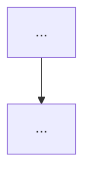
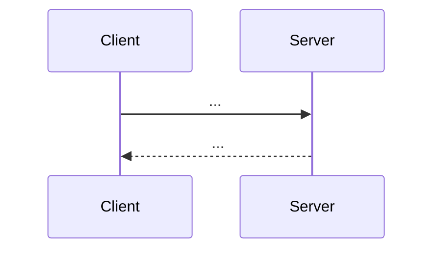

# Tech design — <subsystem>

- **Governing spec:** `design/scope/prototype-scope.md#<section>`
- **Governing domain doc(s):** <paths>
- **Accepted ADRs that bear on this design:** <paths>
- **Status:** Draft | Approved
- **Date:** YYYY-MM-DD

## Non-technical summary

<Plain-English paragraph for the human, describing what this
subsystem is and how it fits into the game.>

## Responsibilities

- <what this subsystem owns>
- ...

## Non-responsibilities

- <what this subsystem explicitly does not own; cross-refs to who does>
- ...

## Module shape



- <module>: <purpose, public interface in one sentence>
- ...

## Public interfaces

For each interface this subsystem exposes, give the exact signature
(in the project's chosen language; pseudocode if stack not yet chosen).

```
<signature 1>
<signature 2>
```

## State and data

- <entity>: shape, ownership, mutation rules.
- ...

## Data flow



## Dependencies on other subsystems

Must be acyclic. If cycles appear, stop and redesign.

- Depends on: <subsystem>: <why>
- ...

## Invariants preserved

Cross-reference the invariants from the governing domain doc.

- <invariant>: <how this design preserves it>
- ...

## Failure modes

- <mode>: <observable signal>, <recovery>.
- ...

## Testing strategy

- <interface or behavior>: <test shape>, <cost>.
- ...

## Decisions that required ADRs

Every non-obvious design choice here should be backed by an ADR.

- <decision>: ADR <path>
- ...

## Addressed concerns

Synthesis of role-quartet and skeptic critiques, same format as an
ADR. (Tech designs run the same gate.)

### architect
- ...

### engineer
- ...

### game-designer
- ...

### operator
- ...

### skeptic
- ...

## Follow-ups

- ...
